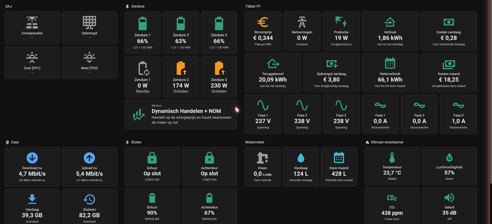

# Energie & Huis Dashboard voor Home Assistant

Een dashboard in een strakke kaartenstijl: zonnepanelen, thuisbatterijen, dynamische
energieprijzen, netwerkdata, watermeter, slimme sloten en binnenklimaat. Allemaal
dezelfde bouwstenen met kleurcodering (groen = goed/actief, oranje = let op, rood =
probleem, grijs = inactief).

## Vereisten

1. Home Assistant (recente versie, dashboards met secties)
2. HACS met daaruit: **button-card** (verplicht, alle kaarten zijn hierop gebouwd)
3. Eigen integraties per sectie (zie tabel hieronder); secties die je niet hebt
   verwijder je gewoon.

## Installatie

1. HACS → zoek "button-card" → Download → browser herladen als daarom wordt gevraagd.
2. Instellingen → Dashboards → Dashboard toevoegen → "Nieuw dashboard, helemaal zelf".
3. Open het nieuwe dashboard → potlood (bewerken) → drie puntjes → "Ruwe
   configuratie-editor".
4. Verwijder de inhoud en plak de volledige inhoud van [`dashboard.json`](dashboard.json)
   erin → Opslaan. (JSON is geldige YAML, dit werkt direct.)
5. Vervang de entiteitsnamen door die van jouw eigen sensoren (zie hieronder).

## Entiteiten aanpassen

Zoek-en-vervang in de ruwe editor (Ctrl+F werkt daar):

| Sectie | Entiteiten in dit bestand | Vervang door jouw |
|---|---|---|
| SAJ (zon) | `sensor.saj_*` | jouw omvormer-sensoren (vermogen, PV1/PV2, dagopbrengst) |
| Zendure | `sensor.zendure_*`, `input_select.zendure_2400_ac_modus_selecteren` | vereist de [Zendure-HA-zenSDK](https://github.com/Gielz1986/Zendure-HA-zenSDK) integratie + bij meerdere units de [Node-RED proxy](https://github.com/gast777/Zendure-zenSDK-proxy) |
| Tibber P1 | `sensor.meterkast_*` | jouw Tibber/P1-sensoren (prijs, vermogen, dag/maand-tellers) |
| Data | `sensor.rbr850_*` | jouw router-sensoren (Netgear-integratie) |
| Watermeter | `sensor.hw_watermeter_*` | jouw HomeWizard watermeter |
| Sloten | `lock.schuur`, `lock.achterdeur` + batterijsensoren | jouw sloten |
| Klimaat | `sensor.woonkamer_indoor_*` | jouw Netatmo/klimaatsensoren |

## Zelf aan te maken helpers (Instellingen → Apparaten en diensten → Helpers)

- **Afgeleide sensor** (2×) voor actuele netwerksnelheid: bron = download/upload-teller
  van je router, tijdvenster 5 min, tijdseenheid minuten.
- **Verbruiksmeter** (2×) voor waterverbruik vandaag/deze maand: bron = totaalteller
  van je watermeter, cyclus dagelijks resp. maandelijks.

## Tips

- Kleuren/drempels staan als JavaScript-templates in elke kaart en zijn makkelijk
  aan te passen (zoek op `#01a180`).
- Werkt het niet? Controleer eerst of button-card echt geladen is (harde refresh,
  Ctrl+Shift+R).
